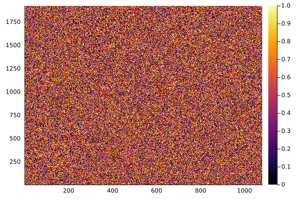
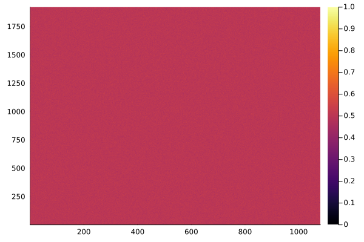

# All the Ways to GPU

At the end of the day, GPUs are pieces of hardware.
Complicated pieces of hardware.
In fact, GPUs (and modern CPUs) are so complicated that it would be nearly impossible for an individual to directly write down a set of instructions for the hardware to run.
Instead, users write code in some human-readable language like C, Rust, or Julia, which will then be translated to some other language, and then (often times) another language again and again until it becomes the final instruction set that their hardware can execute.
This process is known as compilation.
As a rule of thumb, the easier it is to read and write in a programming language, the more difficult the compilation process will be.

At every layer of compilation, we are further simplifying the translation process through software abstractions.
Simply put, an abstraction is a metaphorical device used to make a complex task easier to understand.
We use abstractions *everywhere* in programming.
Examples include: `for` and `while` loops, functions, structures and classes, etc.
Basically every common programming device we use is an abstraction of some form.
In this chapter, I will introduce many common abstractions that can be used  to perform GPU computation, but let's start at the start.

## Installation

I think it is important to pause a second before jumping in to the water to remind ourselves of a simple truth: the first step of any project is always the hardest.
This also holds true for programming, so if you find yourself a little lost while reading this chapter, that's totally normal.
It's ok to put the book down.
It's ok to ask for help.
The most important thing is that you are steadily making progress towards your goals, whatever they might be.

Now let's begin.

As mentioned in the introduction, we will be using the Julia programming language for this book, so the first step is to install Julia.
It is important to note that this book is intended for those who already have some (at least limited) familiarity with programming.
As such, I will keep the installation instructions brief.
If you are already used to programming, you probably already have your own preferred development workflows all sorted out and can just google for similar solutions with Julia.

For most users, installation involves going to the website [https://julialang.org/downloads/](https://julialang.org/downloads/) [^1] and following the instructions.
The website provides both binaries for your operating system as well as a command to install a package called `juliaup` which will allow you to easily update Julia in the future.
Linux users (or those with the appropriate software on Windows or Mac) can also install Julia with their package manager.
With Julia installed, the next step is decide how to edit code.
There are generally two options here:

1. With text editors. This means that you will use your text editor of choice (for example: vim, nano, notepad++) and then manage all of your code on your own. You might want to google around for most common options with Julia.
2. With development environments. These are collections of all the things programmers typically need for development packaged into one graphical interface. The most common one for Julia is VSCode, with full installation instructions found here: [https://code.visualstudio.com/docs/languages/julia](https://code.visualstudio.com/docs/languages/julia)[^2].

Keep in mind that if you are *not* using Julia and have instead decided to rewrite the code in this book in another language, the installation might be significantly different and potentially more complicated.

[^1]: https://julialang.org/downloads/
[^2]: https://code.visualstudio.com/docs/languages/julia](https://code.visualstudio.com/docs/languages/julia

## Figuring out your hardware

Now that we have Julia installed, we can start using our GPU!
As I discussed in the introduction, the current state of GPU programming is (unfortunately) quite fragmented, so the first step is to identify the hardware on your system.
Ideally, you already know this information (because you bought or built your own computer and can look at the specifications), but here's some hints to figure out what you have depending on your operating system:

* **Windows**: Go to the "Device Manager" and look under "Display Adapters", where you should find the manufacturer of your GPU.
* **Mac**: Go to "About this Mac". If it says you are running an "Apple M$$x$$" chip, where $$x$$ is some number, then you can use your Apple Silicon GPU. Otherwise, there might some other GPU shown there.
* **Linux**: To be honest, there are a bunch of different ways to figure out what hardware you are running, so feel free to google and use your preferred method. My go-to is always `lspci | grep "VGA"`, which will tell you what GPUs you have. Other options include `lshw -C display` or just pasting `about:support` into the URL for Firefox.

In the case you have more than one GPU available, feel free to use whichever one you want (or all of them).
If you do not have a usable GPU, that is totally ok!
You can use your CPU instead for almost everything in this book.

If you could not figure out whether you have a usable GPU at this stage, that's also totally fine.
We can use Julia to figure out which packages will work on your machine.
More on that in a moment.

For now, let's talk about the Julia packages available for your hardware:

| Hardware Available | Julia Package | Julia Array Type |
| ------------------ | ------------- | --------------- |
| Parallel CPU       | none          | Array           |
| NVIDIA GPU         | CUDA          | CuArray         |
| AMD GPU            | AMDGPU        | ROCArray        |
| Intel GPU          | oneAPI        | oneArray        |
| Apple Silicon      | Metal         | MtlArray        |

Keep in mind that the package names here follow the naming conventions for the traditional software tooling of your hardware.
Julia's package for NVIDIA GPUs is `CUDA`, because it compiles down to the same thing as CUDA (a C language extension for NVIDIA GPU tooling), but does so in Julia.
At this point, if you already know your GPU hardware, simply install the relevant package by using the following commands:

1. `julia`: This will open the Julia shell (called the REPL, which stands for "Read, Evaluate, Print, and Loop"). You should see an ASCII Julia logo appear and then a green `julia>` prompt.
2. Press the `]` key: This will open up the package manager and change the prompt to something like `(@v1.10) pkg>`. It will also change the color of the prompt to blue.
3. `add GPUBackend`: Where `GPUBackend` is the appropriate package listed in the table above. For example, I have an AMD GPU, so I will `add AMDGPU`. If I were running an M2 mac, I would `add Metal`. If I had an NVIDIA GPU, I would `add CUDA`. Keep in mind that this might take some time because it's installing a lot of GPU driver magic in the background.
4. Press backspace: This will leave the package manager
5. type `using GPUBackend`: Remember that `GPUBackend` is the package you need for your specific hardware. This will load the package in the Julia REPL. This might take a second as it's compiling everything for the first time.
6. `GPUBackend.functional()`: This will test to make sure the package will work on your machine. It *should* return `true` if you have the right hardware available.

If `GPUBackend.functional()` returns `false`, then there is something wrong with the configuration.
That is absolutely no problem for the purposes of this text, as you can simply use parallel CPU execution instead of the GPU; however, it might be worth googling around to try to figure out why your GPU is not working (and maybe even create an issue on github for the appropriate package if you feel your GPU *should* be supported, but isn't).

Also note that there could have been any number of things that could have gone wrong during this installation process.
If the steps above did not work for you, then it is important to search around for a solution.
If you can't find a solution, then it's a good idea to reach out to the Julia slack community (there is a `#gpu` for this kind of thing) or the Julia Discourse.
If neither of those resources are helpful, then it might be worth creating an issue for your specific GPU backend.


!!! tip "But what if I don't know my hardware?"
    In this case, just install all the packages and test them all.
    Remember, use `]` to enter the package manager (`(@v1.10) pkg>`) and backspace to return to the Julia REPL (`julia>`):
    ```
    (@v1.10) pkg> add AMDGPU CUDA oneAPI Metal
    julia> using AMDGPU, Metal, oneAPI, CUDA
    julia> AMDGPU.functional()
    true
    
    julia> Metal.functional()
    false
    
    julia> oneAPI.functional()
    false
    
    julia> CUDA.functional()
    false
    ```
    Here, I have a working AMD GPU, but none of the other vendors will work.
    I omitted a few error messages that appeared on my machine when `using Metal` and `using oneAPI` as not all users will experience those errors. Both of these packages informed me immediately that my hardware was not supported, so I did not need to run `.functional()` on those packages (but I did anyway for clarity).
    
    After you have found the appropriate package on your machine, feel free to remove the unnecessary ones with:
    
    ```
    (@v1.10) pkg> rm GPUBackend1 GPUBackend2 GPUBackend3 ...
    ```

!!! tip "But what if I can't (or don't want to) use the package mode (`]`)?"
    You can actually use the package manager as a package, itself, so...
    ```
    julia> using Pkg
    julia> Pkg.add("GPUBackend")
    ```
    Where `GPUBackend` comes from the table above. There are a few situations where it just makes more sense to use the `Pkg` package instead of entering package mode with `]`.

!!! note "Reviewer Notice"
    I actually think the `using Pkg` method is more straightforward for beginners. Should we do that one by default and have a separate tip to explain the `]` package management mode?
    
    I introduced `]` first because (let's be honest) that's how the majority of people interface with the package manager; however, `using Pkg` is necessary for scripts and CI, so it is also important to know.

As a final note before continuing, we will be using the notation from the previous table throughout this book.
That is to say that I will be using `GPUBackend` to refer to your specific package (such as `AMDGPU` on my machine) and `ArrayType` to refer to the array type from that package (`ROCArray` on my machine).
In the case you "just want to run the code" provided here, it might be worth setting these in your Julia REPL and future scripts.
For example, on my machine, I might set:

```
GPUBackend = AMDGPU
ArrayType = ROCArray
```

If you are using your CPU to emulate GPU execution for this work, then you do not need to set your `GPUBackend` and instead can remove `GPUBackend` from all code blocks for them to run.
It is up to you how you wish to proceed here and what suits your learning style best.
Regardless, we should have all (hopefully) finished installation at this point, so it's time to actually get some work done.

## Your first GPU array
 
Alright, we've chosen our appropriate package.
Now let's create an array and pass the data to the GPU.

```
julia> a = zeros(10, 10)
julia> b = ArrayType(a)
```

There are a lot of things to talk about.
`zeros(...)` is a Julia method to create an array that is all 0 of a particular size. Here, it's 10 by 10.
This command will create an `Array` object whose memory exists "on the CPU".
More accurately, the memory will sit on the motherboard RAM, a convenient location for CPU operations.
We then need to send that data to the GPU by casting it onto the appropriate array type for our hardware with `ArrayType(a)`.
Here, `ArrayType` is the array type from the table above.
For example, those with an AMD GPU would use `ROCArray`.
Those with an NVIDIA GPU would use `CuArray`.
Those with Apple Silicon would use `MtlArray`.

It is important to note that the command `ArrayType(a)` is actually doing two things at once:
1. Allocating the appropriate space on the GPU
2. Copying the data from the CPU to GPU.

In Julia, these two steps are often coupled, but they don't need to be.
For instance, In CUDA (C) a user might use both a `cudaMalloc(...)` and `cudaMemcpy(...)`.
In Julia, we could also avoid the memory transfer and create the array directly on the GPU with:

```
b = GPUBackend.zeros(10,10)
```

This would avoid the (relatively) costly communication between the CPU and GPU.
In fact, most of the array creation routines (such as `rand(...)`, and `ones(...)` have similar routines for each backend for simplicity.

!!! tip "A note about Macs"
    If you are running a Mac, you might not have been able to create your array on the GPU.
    This is because Metal (the interface used for GPU computation on Apple Silicon) only supports single precision (`Float32` and `Int32` for example).
    So to create the necessary array on a mac, specify the type for `zeros(...)` first, like so:
    ```
    julia> a = zeros(Float32, 10, 10)
    julia> b = MtlArray(a)

    ```

Now, depending on your machine, you might have had to wait a few seconds to generate your initial array.
What gives?
Isn't GPU computing supposed to be fast?
Why do we need to wait around all the time?

Well, one core difference between CPU and GPU programming is in how users think about the code.
On the CPU, users typically think about the number of operations each core is performing.
Though this is still important with the GPU, calculation speed is often not the biggest bottleneck to GPU performance.
Instead, GPU programmers need to think about data flow, where data is in GPU memory.
As a rule of thumb, the slowest part of any computation is communication -- specifically communication between the CPU and GPU, but also between different memory banks within the GPU, itself.
This has a large number of implications that we will discuss in later chapters.

Even so, the transfer time of data for a relatively small array (like this one) *should* still be around a millisecond or two.
My guess is that most users felt a significant delay of about a second or two when they created their first array.
As a quick test, try to do the same command again (`ArrayType(a)`).
This time, it should be really fast.
The truth is that there is another, more important reason why the first array took so long to build.
Let's talk about...

### Expected performance from Julia

It's time to be upfront about one of the core weaknesses of Julia.
At this stage, there are probably two distinct groups of people:

1. Those that are new to GPU programming. These people are probably scratching their head at all the new, unnecessary packages. After all, they just want to use their GPU! Why do they need to think so deeply about their hardware?
2. Those who have attempted GPU programming before. These people are probably amazed at how easy the installation was. Julia *just did everything for us* in a way that seemed like magic!

There is a little truth to both of these claims.
Yes, Julia does a lot of the heavy lifting for the user.
And yes, there is still a lot of jank we are trying to get rid of.

But there's another (potentially ill-formed) thought that might be lurking in the back of your mind, "If all these Julia packages are just wrappers to C, why not use C instead? Won't we get a performance penalty for using Julia here?"

That's a very good question, and it's difficult to fully explain.
Long story short, Julia boils down to the same lower-level representation as C (if you are using the clang compiler), so it should be equivalently fast.
It can also call C code without any performance penalty, so the wrappers to C should be equivalently fast.
That said, we do need to draw a thin line in the sand here.
In the case of GPU computing, we are not comparing ourselves to C, but CUDA (or Metal, AMD, etc).
The lower-level representation of GPU languages are all *slightly* different than that of C.
This means that in the case of GPU computing, we are actually asking Julia to do a lot.
It has to dynamically determine our hardware, compile the Julia code into some intermediate representation, then spit out even lower level code that is distinct for each hardware vendor, all while maintaining the features that make Julia easy to use for beginners.

When we put it all together, the compilation time for the JuliaGPU ecosystem can sometimes be much higher than for many other GPU languages.
To be clear, we usually call compilation "**pre**compilation" in Julia because the translation happens dynamically (immediately after Julia can statically know what all the types are when the user runs their code).
Let's try to quantify our precompilation cost a bit by re-running the code with the `@time` macro:


```
julia> a = zeros(10,10);

julia> GPUBackend.@time ROCArray(a);

julia> GPUBackend.@time ROCArray(a)
```

For me, this looks like:

```
julia> a = zeros(10,10);

julia> AMDGPU.@time ROCArray(a);
  1.676601 seconds (7.35 M allocations: 508.234 MiB, 14.36% gc time, 85.91% comp
ilation time)

julia> AMDGPU.@time ROCArray(a);
  0.000370 seconds (12 allocations: 368 bytes)
```

The second run was literally 4,500 times faster!
It's important to also look at the information in parentheses.
The first run had 7.35 million allocations and spent 85% of it's time precompiling.
The other roughly 15% of time was spent on garbage collection (cleaning up unnecessarily allocated memory).
The second run had 12 allocations and no time at all on garbage collection or precompilation.
It was also less than a millisecond.

It is really important to keep in mind that Julia can (and should) get comparable performance to C in most cases, but we need to give it a second to precompile everything first.
Even though many people in the Julia community are working on decreasing precompilation time, it is unlikely that this will go away entirely any time soon.
If your specific GPU project requires fast recompilation regularly (which is the case for some graphics workflows), then you might need to take the lessons from this book and translate them into another language in the future.

That said, I truly believe that Julia provides the most flexible ecosystem for most GPU workflows and should be a great starting language for any GPU project.
In particular, it is the only language that provides so many different abstractions for doing GPU computation.
Speaking of which, it's time to talk about them in detail.

## I have a GPU array. Now what?

Well, there are a lot of things we can do, actually, but let's start with the basics: indexing.
Indexing is the act of accessing array memory one element (index) at a time.
On the CPU, you might create an array, `a`, and get the first index with `a[1]`.
It might be reasonable to assume that similar logic would work on the GPU, so let's try it:


```
julia> using GPUBackend

julia> a = ones(10,10);

julia> b = ArrayType(a);

julia> a[1]
1.0

julia> b[1];
ERROR: Scalar indexing is disallowed.
Invocation of getindex resulted in scalar indexing of a GPU array.
This is typically caused by calling an iterating implementation of a method.
Such implementations *do not* execute on the GPU, but very slowly on the CPU,
and therefore should be avoided.

If you want to allow scalar iteration, use `allowscalar` or `@allowscalar`
to enable scalar iteration globally or for the operations in question.
Stacktrace:

...

```

As a reminder, `GPUBackend` and `ArrayType` depends on your hardware and can be found in the installation section.

But what's the deal?
Why can't I access elements of my GPU array?
What does "scalar indexing" even mean?

Simply put, scalar indexing is the act of accessing an array one element at a time, for example `a[1]`, `a[2]`, or `a[i]`, where `i` is some integer value.
As to why this is not allowed on the GPU, well... there are a bunch of factors all working against each other to make scalar indexing difficult.
Remember, GPU memory is not "on the CPU."
When we run `a[1]`, we are asking Julia to display that data in the REPL, but we can't do that without first transferring it to the motherboard RAM.
With this scalar indexing error, Julia is asking us to be doubly sure that this is, in fact, what we want to do because (again) communication is slow.
If we are absolutely sure that we want to display the first element of `b`, then it is best to be more explicit and first transfer the data back to the CPU with something like `Array(b)[1]`, where `Array(b)` will transfer the data, and the `[1]` at the end will access the first element of the newly created CPU-based array.

It's also important to remember that GPUs are intended to do a lot of things in parallel.
This power is lost completely if we ask Julia to deal with only a single element at a time.
Simply put, if users are using the GPU one index at a time, it's going to be really, really slow, so we need to do what we can to discourage that behaviour whenever possible.

!!! tip "But what if I *really* need scalar indexing"
    Keep in mind that if you *really* need to access a single element of a GPU array and do not want to transfer the data to the CPU first, you can do it by first setting the `allowscalar` flag `true` (and then turning it off again afterwards):
    ```
    julia> GPUBackend.allowscalar(true)
    ┌ Warning: It's not recommended to use allowscalar([true]) to allow scalar indexing.
    │ Instead, use `allowscalar() do end` or `@allowscalar` to denote exactly which operations can use scalar operations.
    └ @ GPUArraysCore ~/.julia/packages/GPUArraysCore/GMsgk/src/GPUArraysCore.jl:188
    
    julia> b[1]
    1.0
    
    julia> GPUBackend.allowscalar(false)
    
    ```
    
    You can also wrap the necessary code in a `do` block, like so:

    ```
    GPUBackend.allowscalar() do
        b[1]
    end

    ```
    Or use the provided macro
    ```
    GPUBackend.@allowscalar b[1]
    ```

So now that we've shaken everyone up a little bit by talking about something that is simultaneously trivial on CPUs and next to impossible on GPUs, let's talk about things we can *actually* do with our GPU array.

In the next few sections, I will be discussing three different abstractions that are commonly used for GPU programming:
1. Broadcasting: the act of applying the same command to every element in an array.
2. GPU functions (called kernels): the act of writing a specific function that gives instructions to each GPU core
3. Loop vectorization: the act of transforming a `for` or `while` loop for GPU execution.

Before going further, it's worth noting that these abstractions are not available for all languages.
For example, CUDA and OpenCL focus almost exclusively on user-defined GPU functions.
SyCL and Kokkos focus on loop vectorization.
Julia is unique in that all three of these major abstractions are deeply ingrained into the ecosystem as a whole and play very nicely not only with each other, but the broader Julia ecosystem.

If you are planning on rewriting all the code in this book with another language, it might be a good idea to first jump to the abstraction that works well in the language you have chosen and then come back to the other sections as needed.
For now, I intend to cover things in the order that feels most intuitive for GPU computation in Julia, starting with...

### Broadcasting

Ok.
I get it.
Most programmers have probably never used broadcasting.
Many have probably never heard of it before now.
Before using Julia, I certainly hadn't.
So let's start at the start.

To reiterate, *broadcasting* is the act of applying the same command (broadcasting in the colloquial sense) to every element in an array.
Though accessing individual elements of a GPU array is a little complicated, applying the same operation to all elements of an array is surprisingly easy -- in fact, it's perfect for the GPU!

So let's look at some basic syntax on the CPU first:

```
julia> a = zeros(10)
10-element Vector{Float64}:
 0.0
 0.0
 0.0
 0.0
 0.0
 0.0
 0.0
 0.0
 0.0
 0.0

julia> a .= 1
10-element Vector{Float64}:
 1.0
 1.0
 1.0
 1.0
 1.0
 1.0
 1.0
 1.0
 1.0
 1.0

```

In Julia, the `.` before some command indicates to the compiler that the user would like to broadcast the command to all elements of an array.
So, these lines:
1. Created an array (`Vector`) of ten zeros, called `a`.
2. Broadcasted the `= 1` command to each element of the array, indicated with `.= 1`

Now for some Julia magic: as long as you are can write your GPU code as broadcasted operations, it should be possible to execute that code in parallel on the GPU.
For example, the following will also work:

```
julia> using GPUBackend

julia> a = GPUBackend.zeros(10);

julia> a .+= 1
10-element ArrayType{Float32, 1, ...}:
 1.0
 1.0
 1.0
 1.0
 1.0
 1.0
 1.0
 1.0
 1.0
 1.0

```

And there you have it!
You've just executed your first function on the GPU.
Note that in this case, we switched things up a bit and used the `.+=` command instead of `.=`.
This simply means that we added 1 to every element (the `+=` operation) instead of setting every element equal to (`=`) 1.
That said, we probably want to do things way more complicated than just adding one to every element of an array, so let's look at a few quick examples of broadcasting in practice.

!!! tip "What's up with the semicolon (`;`)?"
    In the Julia REPL, you can add a semicolon (`;`) to the end of a line if you do not want to show the output immediately.
    I'll be using this throughout the book to make the text a little more clear to read.

#### Setting every odd element to 1

We just added one to every element.
What if we want to do something similar, but for every *odd* element?
To do this, we need to define a custom *range* for accessing our Julia array.
For example, if we want access only the first five elements of an array, we might use the range `1:5`.
If we want to choose every other element, then we would go in steps of two, so `1:2:5`.
Putting this together, if we want to set every odd element of an array to 1, we might do...

```
julia> a = zeros(10);

julia> a[1:2:10] .= 1;

julia> a
10-element Vector{Float64}:
 1.0
 0.0
 1.0
 0.0
 1.0
 0.0
 1.0
 0.0
 1.0
 0.0

```

And that's that.
This was just a simple way of showing that any mathematical operation can be broadcasted, even if that operation is just assigning values.

Now for a few quick exercises to make sure we understand everything:

!!! todo "Problem 1: Do it on the GPU"
    Do what we just did on your GPU backend. In other words, change the array type of `a` to your `ArrayType` and add one to every other element.

!!! todo "Problem 2: Subtract 1 from every even element"
    Create some broadcast operation that will subtract one from every even element.

!!! todo "Problem 3: Square each element of the array"
    For context, `x^y` is the math operator in Julia to "raise some number (`x`) to the power of some other number (`y`).
    So the squaring operator in Julia for a single value would look like `x ^= 2`.
    
    Now broadcast that operation to your entire array.

#### What's the difference between indexing and broadcasting?

Right.
Good question.

We just had two sections back-to-back with seemingly contradictory claims:
1. It's not a good idea to grab individual indices of a GPU array.
2. It's a *great* idea to grab multiple indices at once.

For many users, it might not be clear what the distinction is here.
After all, what is the difference between `a[1]` and `a[1:5]`?
Why is the latter so fundamentally different in Julia?

It is actually difficult to answer this question without digging in to the Julia programming language, itself (and the `base/broadcast.jl` file), but the simplest explanation is that the `.` before any operation signifies that the user would like to call the Julia `map` function, which distributes a function across elements of an array.
For the Julia GPU ecosystem (in the `GPUArrays.jl` package), any broadcasted operation will actually create a specific GPU function for the `map`.

Simply put: if you are just trying to access a single element of a GPU array, we can not easily transform that into a GPU function that works in parallel on your hardware.
If you are trying to *do something* with a bunch of elements, then it is easy(ish) to do so.

And if you are wondering, yes.
This does mean that you can get around the scalar indexing warning by using a range with only a single element, like:

```
julia> a = zeros(5):

julia> b = ROCArray(a):

julia> b[1:1]
1-element ROCArray{Float64, 1, AMDGPU.Runtime.Mem.HIPBuffer}:
 0.0
```

Please don't abuse this too much.

#### Vector addition

When it comes to GPU computation, there is a single problem that every single person does to make sure their code is working as intended.
It is so common, that the problem is often called the "'Hello World!' of GPU computation.
That problem is vector addition, the act of adding two vectors (lists of numbers) together.
Let's do it with broadcasting.

```
julia> a = rand(10)
10-element Vector{Float64}:
 0.3446361752270596
 0.6044872863666282
 0.8081681226442919
 0.6586667828785924
 0.23172116207667204
 0.08632001843030668
 0.09675977506693823
 0.6771842850312151
 0.019671351328815923
 0.7149572102336769

julia> b = rand(10)
10-element Vector{Float64}:
 0.30677966842793747
 0.27954729235962206
 0.37278805220786826
 0.7667780614002805
 0.9295691111986113
 0.6457830807742259
 0.4943043624323966
 0.8731592407550742
 0.3415622970290325
 0.32403477239711587

julia> c = a .+ b
10-element Vector{Float64}:
 0.651415843654997
 0.8840345787262502
 1.1809561748521602
 1.4254448442788727
 1.1612902732752834
 0.7321030992045325
 0.5910641374993348
 1.5503435257862894
 0.36123364835784844
 1.0389919826307927
```

So there's a lot to unpack here.
Firstly, broadcasting can work in general on the right-hand side of any math equation (here shown with the `.+` between `a` and `b`)..
Secondly, `rand(...)` works the same way as `zeros(...)` or `ones(...)`.
Right now that might seem trivial, but random numbers are actually a little hard to do on GPUs, so we'll talk about that in a little more depth later.
Thirdly, it's important to note that `a` and `b` must be the same size for this to work, so make sure that's true before broadcasting operations to more than one array.

But there's a more subtle point here that many people might have missed, and it has to do with the third command, `c = a .+ b`.
Simply put, `c` did not exist before running the command!
This means that we have created a new array for the sole purpose of outputting the results of  `a .+ b`.

Though this might not seem particularly noteworthy on the CPU, it actually has large implications for the GPU.
Remember that the slowest part of most computation is memory management, and here, we have allocated space for and assigned the values to a random array without even considering the consequences to performance!
Allocation takes time!
If at all possible, we want to minimize the number of times we create new arrays.

So how might we rewrite things so that we don't unnecessarily allocate `c`?
Well, the simplest solution is to allocate it at the same time as `a` and `b` and then use `.=` instead of `=`:

```
julia> a = rand(10);

julia> b = rand(10);

julia> c = similar(a);

julia> c .= a .+ b
```

Here, we use `similar(a)`, which will create an array that is the same size, shape, and type as `a`, which should (hopefully) also be the same size, shape, and type as `b`.
The data in `c` from `similar` will be just whatever junk was in memory at the time and won't necessarily be all zeros or anything.
That shouldn't matter because `c` is used exclusively for output, so there's no reason to invoke `rand(...)` if we don't need it.

There are actually distinct terms to distinguish between the two different types of computation we did:
1. **In Place** computation is when all operations act on *already existing* data. In this case, the `.=` command broadcasts `c[i] = a[i] + b[i]` to all elements of the array, assuming `a`, `b`, and `c` already exist.
2. **Out of Place** computation is when some operations *create new data*. In this case, the `=` sign assigns the output of `a .+ b` to a new array, called `c`.

So `c = a .+ b` was *out of place*, while `c .= a .+ b` was *in place*.
It's important to keep this in mind for later.
Remember that data flow *really* matters with GPU computation, so it's doubly important to make sure you know where your data lives.

A quick note.
I would like to believe that *every single Julia programmer* has been tripped up by the difference between `=` and `.=`.
I certainly have torn my own hair out late in the evening, trying to figure out why the performance of my code is so slow, only to realize I forgot a single `.`, which meant that I was creating a bunch of new arrays instead of writing to pre-existing arrays.
This type of stuff happens to the best of us, which is why I am pointing it out now while you are young and impressionable.
Julia syntax sometimes looks sleek, but there's a lot of power under-the-hood, so it is wise to take a second and make sure every line is actually doing what you want. 

I think that's it for now.
On to some problems.

!!! todo "Problem 4: Try to add arrays of different sizes"
    ... and see the error message.

!!! todo "Problem 5: Do it on the GPU"
    Create three arrays, `a`, `b`, and `c`, all of type `ArrayType` for your specific GPU backend. Add `a` and `b` together and output them to `c`.
    You may create `a`, `b`, and `c` in any way you wish, but it might be more interesting to use `ones(...)` or `rand(...)` instead of `zeros(...)` because $$0 + 0 = 0$$.

!!! todo "Problem 6: Add the first five elements of `a` to the last five elements of `b`"
    Create custom ranges so you can add one through five of `a` to five through ten of `b`.
    Remember that your output array (`c`), should be five elements this time!

#### Broadcasting generic functions

Until now, we have been broadcasting pre-defined Julia functions (mainly math operations), but what if we wanted to broadcast our own (user-defined) functions?
Well, let's do that.
Let's say we wanted to find ten numbers between one and one-hundred.
We might create a function that looks like this:

```
julia> f(x) = round(Int, x*100)
```

This would take some input (`x`), multiply it by one-hundred, and then round it to the nearest integer value (`Int`).
So `f(0.5)` is `50`.
`f(0.6542)` is `65`.
And so on.
Now let's broadcast that function to an array of random numbers:

```
julia> a = rand(10);

julia> f.(a)
10-element Vector{Int64}:
 15
 46
 12
 11
 15
 13
 13
 60
 89
 89

```

Here, we've used the `.` operator to signify that we want the function broadcasted along all elements of the argument of `f`.
Now let's create another function to do the vector addition from the previous section:

```
julia> g(a, b) = a + b
g (generic function with 1 method)

julia> a = rand(10);

julia> b = rand(10);

julia> c = similar(a);

julia> c .= g.(a, b)
10-element Vector{Float64}:
 1.1339661653178916
 0.9405969685936231
 1.576334145965099
 0.6608638707221182
 1.2142578652057847
 1.3606689325191113
 0.7669673576476489
 1.7838687185111035
 1.370863980086035
 1.5491853434156098

```

There are actually many different ways we could have done that.
For example, we could have made `g` use `c` as an argument and then used `g.(c, a, b)`.
We could have also written our function using slightly different syntax in Julia, like:
```
functon g(a, b)
    return a + b
end
```
Feel free to explore different ways to do this if you want.
In fact, I actively encourage you to do so.

For now, let's wrap everything we've learned about broadcasting into a worked example that also shows off some of the power of GPU computing.

!!! note "Reviewer Notice"
    I am thinking of replacing this upcoming section with something else that is potentially more interesting.
    Maybe one of the [Diehard tests](https://en.wikipedia.org/wiki/Diehard_tests)?
    I just couldn't think of one that works so well with broadcasting.

#### A simple exercise: "Where did the noise go?"

Until now, I have avoided timing the majority of the our code because I wanted to make a point about GPU computation.
Namely, if you are only working with a few elements at a time, the CPU will usually be faster.
For example, here are the timing results for vector addition on my computer.
First, let's do the CPU:

```
julia> a = rand(10);

julia> b = rand(10);

julia> c = similar(a);

julia> @time c .= a .+ b
  0.000003 seconds (1 allocation: 32 bytes)

```

Now for the GPU:

```
julia> using AMDGPU

julia> gpu_a = ROCArray(a);

julia> gpu_b = ROCArray(b);

julia> gpu_c = similar(gpu_a);

julia> AMDGPU.@time gpu_c .= gpu_a + gpu_b;
  0.000054 seconds (46 allocations: 2.500 KiB)

```

Note that for both of these timings, I have shown only the results of the second run of the code to avoid precompilation overhead.
Even so, it's clear the CPU is faster.
How much faster?

```
julia> 0.000054 / 0.000003
18.0

```

18 times.
It's 18 times faster to avoid the GPU entirely!
Why?
Well, we are doing operations that are a little *too* simple on arrays that are really, really small.
I mean, the CPU took three *micro*seconds.
The GPU was fifty-four microseconds.
Can we really draw any conclusions from such small numbers?

To really see some performance from the GPU, let's do something a little complicated.
We are going to make an array of random numbers... disappear!

First, let's install the plotting package, `Plots`.
Remember to enter Julia's package mode with `]` (and then `enter`).
Then:

```
(@v1.10) pkg> add Plots
```
Now press backspace to enter the Julia shell.
We can now create a large matrix of random numbers and plot it:

```
julia> using Plots

julia> a = rand(1920, 1080);

julia> heatmap(a; clims = (0,1))
```

I have chosen to make the array 1920x1080 because that mirrors the resolution of a high-definition display.
Also, we are using `heatmap` here (instead of `plot`) because we want a 2D image as output.
I am also using color limits (`clims`) from zeros to one.
This should create an image that looks like this:



Now we are simply going to create a function that adds a random number to elements of `a`, so:

```
f(x) = x + rand()
```

Finally, we'll execute the command 1000 times in a loop and average the results

```
julia> @time for i = 1:1000
           a .= f.(a)
       end
  1.270488 seconds (1000 allocations: 15.625 KiB)

julia> a ./= 1000;
```

It took about 1.5 seconds to do the computation and creates the following image (with `heatmap(a; clims = (0,1))`:



Wow!
The color is gone from our plot as all the values have averaged to 0.5!
What happened?
Well, we just took 1000 random samples on each pixel and averaged them.
Because `rand(...)` gives us a random number between 0 and 1, the final value for each pixel should be the average of 0 and 1, which is 0.5.

!!! note "About looping in Julia..."
    Looping in Julia (and in many languages) generally has two modes: `for` and `while`.
    We have just seen the `for` loop in practice and is most often used over a range of a certain number of elements.
    For example:
    ```
    for i = 1:10
        println(i)
    end
    ```
    Will set the value of `i` to be 1, execute the commant, then set the value of `i` to be 2 and execute the command again.
    After that, it will set the value of `i` to be 3 and execute the command again.
    It will continue this process until it reaches the end of the range provided (`1:10`), which is 10 in this case.
    This process is known as "iteration" and will be discussed in more detail later in this chapter when we talk about loop vectorization.
    For now, I'll mention that the `for` loops allows users to iterate through any container, including `Arrays`, but not GPUArrays due to the scalar iteration issue discussed earlier.
    So the following is also valid:
    ```
    julia> a = [1,3,5,7];
    
    julia> for i in a
               println(i)
           end
    1
    3
    5
    7
    ```

    The other common looping structure in Julia is the `while` loop, which continues executing the same command over and over until some condition is evaluated as `false`.
    For example:
    ```
    i = 1
    while i <= 10
        println(i)
        i += 1
    end
    ```
    This code will also print 1 through 10 as above becaue when `i` evaluates as 11, the statement `i <= 10` is evaluated as `false`, breaking the loop.
    We'll be showing off a bunch of tricks you can do with looping in Julia throughout this text, but it is worthwhile to take a second to introduce them to users who might not be familiar with the syntax.

Ok.
I get it.
It's not that impressive.
There are some fun discussions we could have about testing how random random number generators truly are, but that would take a lot of time.
If you are interested in that kind of stuff, I would recommend you look into Diehard tests.
They are a fun suite of tests specifically for random number generation.
For now, we'll move on to the real magic and run the same code on the GPU:

```
julia> AMDGPU.@time for i = 1:1000
           b .= f.(b)
       end
  0.001738 seconds (18.00 k allocations: 1.068 MiB)

julia> b ./= 1000;
```

Did you see that?
1.738 *milli*seconds.
That's roughly 1000 times faster than our CPU implementation!

Here we (finally) start to see a glimpse of the true power of GPU computing.
On the one hand, we need to balance our complexity a bit.
If the code is too complex, the CPU will do it better because each individual core is stronger.
If there is not enough data (`zeros(10)`), again it's better to stick to the CPU.
But when the GPU is in its element, it can really shine.

Now, don't expect every problem to be 1000 times faster on the GPU.
I have specifically manufactured this toy problem to show off how fast it can be.
In actual applications, developers typically see anywhere from 5-100 times improvement depending on the situation.
Still, it's nice to know that we are doing all of this for a good reason: performance.

!!! todo "Problem 7: Do it on your machine"
    I know some of you were tic-tac-typing along with me through the last exercise.
    Some were not.
    This problem is a gentle encouragement from me to you to make doubly sure you can do the previous example on your own machine with your own GPU.

!!! todo "Problem 8: Make a sine wave"
    Create a range from 0 to 2pi (for example `0:0.1:2pi`).
    Send that to the GPU and broadcast a sine operation to each element (`sin.(...)`).
    After, plot the results (`plot(...)`).

!!! note "Reviewer Notice"
    I need a few more good problems for this section.
    Or maybe not?
    I'll have a bunch more problems at the end and there's only so much you can do with broadcasting.

I think it's time to take a second to discuss the limitations of broadcasting.

#### Some room for development

So here's a weird quirk of the Julia ecosystem.
Something that might cause us to reconsider the speedup noted in the previous section.
Even though broadcasted operations performed on a GPU array are done in parallel by default, the same is not true for traditional CPU `Array`s.
To be doubly clear, this will be executed in parallel:
```
a = GPUBackend.ones(100)
a .+= a
```
but this will not:
```
a = ones(100)
a .+= a
```

There are a lot of good reasons for why this is the case.
Some of it comes down to engineering time.
Some of it comes down to active research questions regarding the proper procedure to distribute generic operations in parallel.
For the purposes of this book, none of that matters because we are talking about GPU execution, specifically.

Ultimately, this means that the comparison between the CPU and GPU made in the previous section might not have been entirely fair.
We were not comparing *parallel* CPU to parallel GPU.
Instead, we were comparing a single CPU core to the *entire power* of the GPU.
If I were instead to use all the cores available on my machine (16), then we could expect to see an order of magnitude improvement on the previous result for the CPU.
So instead of a 1000 times improvement, there might have been only 50 or so.

All said, it's good to point out areas within the Julia language that are being worked on, but are not fully finished yet.
In fact, there are a bunch of similar stories throughout the GPU ecosystem and I will try to point these out as they come up.

#### Final musings on broadcasting for GPU computation

When started working at MIT, I was excited to see what people were actually using the GPU ecosystem in Julia for.
At the time, I came across an ocean simulation project with incredibly enthusiastic developers.
It was fast and intuitive to use, and they highlighted the fact that it was fully functional on the GPU.
Coming from a more traditional graphics background, I was shocked to find out that they had written their entire codebase solely using broadcasting operations and in-built Julia functions.

Upon further reflection, I realized I needed to check my own biases.
Broadcasting provides a hardware-agnostic method for performing almost any mathematical operation!
If a user is exclusively crunching numbers, then there is almost no better abstraction than writing down the math and adding a few `.`s here and there.

Even so, after a few years, the ocean team sought even better performance and eventually rewrote their code using GPU-exclusive functions (kernels), which will be introduced in the following section.
Simply put, broadcasting is an absolutely excellent way to get started with GPU computation in Julia.
It's an intuitive abstraction and will get you *most* of the performance you need from the GPU.

But there's a reason this work is called the *GPU **Kernel** Handbook*.
When you need true flexibility or performance, there is no better abstraction than writing functions specifically for the GPU.

## GPU Functions: Kernels

To recap, we have already introduced a language abstraction, known as *broadcasting*, that can be used out-of-the box in Julia for great GPU performance in most cases.
We also walked through a simple example that used broadcasting to show the power of GPU computing with a 1000 times speed-up (on my hardware, at least) when compared to single-core CPU execution.
This means that we should have some vague notion of how GPU execution works and what problems it's suited for, but now it's time to talk about the most common abstraction used for GPU programming: kernels.

Before going further, I think it's important to talk about the structure of this book.
Simply put, almost every other chapter in this work will be related to writing and running kernels.
This section is intended to provide the most basic level of understanding for kernel development in order to match what we have already discussed with broadcasting.
Subsequent chapters will be much more thorough and build upon this knowledge.

In GPU programming, a *kernel* is a function specifically written to be run on the GPU for some computational task.
In principle, the only difference between a kernel and a regular function is that kernels are meant to run in parallel on each core.
This means that every core should run the *same, exact* function at the same time, but there are a few caveats to mention.
For one, keep in mind that a lot of GPU computation will require more units of computation than there are cores.
For example, a high-definition image might have 1920 x 1080 pixels in it.
If the coloring or shading of each pixel is handled by a single core, then we would need 2,073,600 cores to do the computation.
Unfortunately, the fastest GPUs in the world only have around 10,000 cores available.
So what do we do?
Well, *we* don't really worry about that and instead let a scheduler stage the computation to happen in groups of cores in parallel.

Keep in mind that kernels are abstractions.
They are purposefully hiding information from users to make programming easier.
In this case, users shouldn't need to think about the exact mechanics of scheduling on the GPU and can instead focus on writing down the specific computation that each core should perform.
That said, programmers (like myself) are sometimes pedantic and will often distinguish terms a bit here.
Instead of talking about "cores," which are pieces of hardware, we often talk about "work items" (or "threads" for CUDA), which are abstract representations of cores to later be scheduled on to cores.
To be clear, every work item corresponds to some core performing that computation, but we are letting the compiler choose *which* core each work item will run on.
In this way, we don't need to worry about specifics of GPU hardware and can instead program them from a much more general perspective.

I think that's enough background info for now.
In fact, it might be too much.
Let's get to writing some kernels.
To be clear, each GPU backend (CUDA, AMD, Metal, oneAPI) all provide their own kernel interfaces that work in Julia, but we will be using KernelAbstractions for this work, so we need to start by adding that package.
Start by pressing `]` and then enter to enter package mode. Then:

```
(@v1.10) pkg> add KernelAbstractions
```

Press enter.
Install the library.
Now we are ready to write our first GPU kernel.

### Vector addition, but this time with kernels.

Like I said before, vector addition is the "Hello World!" of GPU programming.
It's one of the simplest units of computation that can be done on the GPU to test functionality.
So, let's start by writing down a function that might add two elements of separate arrays together:

```
function add!(c, a, b, idx)
    c[idx] = a[idx] + b[idx]
end
```

This function will take in three arrays (`a`, `b`, and `c`) and add the `idx` index of `a` and `b` to the `idx` index of  `c`.
So `add!(c, a, b, 1)` would be the same as `c[1] = a[1] + b[1]`.
To be honest, it's a bit of a weird formulation, but bear with me.
From here, it's relatively easy to transform the code into a GPU kernel that works on every work item (core).
We just need to:
1. Add `using KernelAbstractions` to the start of our script.
2. Add the `@kernel` macro to the start of our function.
3. Move the `idx` definition to inside the function with something like `idx = @index(Global)`, where `Global` signifies that we are pulling from all globally available threads.

!!! tip "What's the exclamation point (`!`) for?"
    In programming, there is a concept known as "mutation" that indicates an in-place change to the values of an array or structure.
    For example, setting `a[1] = 5` *mutates* `a`.
    It changes a single element, but `a` is still the same size and shape it was before.
    In Julia, functions can also mutate data, such as in `add!(c, a, b, idx)` above.
    In these cases, it is good practice (though not a requirement) to notate the function with an exclamation point (`!`).
    It's also common to put the array(s) that will be mutated at the start of the argument list, which is why we set the order of `add!` to be `c, a, b` instead of `a, b, c`.
    At the end of the day, these are just small notational changes to help other people understand how your code works.
    It's up to you whether they make sense in your, specific context.

    
```
using KernelAbstractions

@kernel function add!(c, a, b)
    idx = @index(Global)
    c[idx] = a[idx] + b[idx]
end
```

And that's the whole function.
Now we just need to run it.
This is generally done in 3 steps:
1. Configure all the input variables. In this case, it would mean making sure that `a`, `b`, and `c` are all of the appropriate array type for running the code on the GPU or in parallel on the CPU with the generic `Array` type.
2. Configure the kernel. This is done by first getting the right backend (for example, AMD, NVIDIA, Metal, etc), and then running the kernel with that backend as a function argument, so `kernel = add!(get_backend(a))`.
3. Run the kernel with the appropriate arguments, so `kernel(c, a, b, ndrange = length(a))`. Here `ndrange` is an $$n$$-dimensional range of values to index over. In this case, as long as `a`, `b`, and `c` are all the same length, we can set the range to be the `length(...)` of any of the three.

Putting all of that together:

```
a = ArrayType(rand(10))
b = ArrayType(rand(10))
c = similar(a)

backend = get_backend(a)
kernel = add!(backend)
kernel(c, a, b; ndrange = length(a))
```

After running this, `c` should be `a .+ b`.
Actually, now is a perfect time to test our results, so let's do that by comparing the results to broadcasting:

```
using Test

@test c == a .+ b

```

Running this should return `Test Passed` into the REPL.
And that's all there is to it.
Your first GPU kernel.

Take a second to breath and pat yourself on the back a bit.
At this point in time, you have taken a bold step into the world of GPU computing.
There are a lot of specifics to talk about from here, but for many tasks, this level of GPU understanding is already enough to start seeing some benefits from the GPU.
That said, there is still a lot left to do and many more pages in this book, so I do hope you keep reading to learn more.

!!! todo "Problem 9: Do it on your machine"
    In case you haven't done it already, it is important to do this exercise on your own machine to make sure you understand how everything is put together.
    Basically, add `a` and `b` and make sure the results match what you expected from the broadcasting results.

!!! todo "Problem 10: Set each array element equal to it's index"
    Create a simple kernel that sets every element of an array equal to it's index (`idx = @index(Global)` in the previous example)

!!! todo "Problem 11: Create a sine wave"
    Create a simple kernel that creates a sine wave when plotting.
    Then pass it back to the CPU and plot it with `plot(...)` from the `Plots` package.
    
    Hint: You instead of setting each element of the array equal to it's index, set it to some value between 0 and 2*pi and then pass that in to a sin function.
    In the end, it might look like this: `sin(idx / (2*pi))`.

!!! todo "Problem 12: Add half of an array to another array"
    Create two arrays and add the first half of one to the second half of the other.
    This involves creating a custom `ndrange` that might be something like `length(a)/2` where `a` is one of your arrays.

!!! note "Reviewer's Notice"
    Again, looking for more problems.

## A discussion on loop vectorization

At this point in time, we have introduced two separate abstractions for GPU computing: broadcasting and kernels.
We have discussed several core benefits of both, but I acknowledge that neither one is common outside of specific circles.
There is yet another abstraction commonly used for GPU programming.
One that everyone knows (and many people love).
They are one of the first things people learn how to do in any new programming language and are essential tools for almost any workflow.
Yes, I'm talking about loops.

On paper, loops look like perfect abstractions for parallel computing.
After all, they iterate through a list.
It should be entirely possible to distribute that work to multiple cores, so that (for instance) core 1 handles iteration 1 and core 4 handles iteration 4.
In fact, this is precisely what loop vectorization is, and there are plenty of GPU libraries that use loop vectorization for various GPU backends.
That said, these libraries require users to modify their loops in some way for them to run at all on the GPU.

Simply put, the following code will fail due to the scalar indexing issue brought up before:

```
julia> a = ArrayType(zeros(10));

julia> for i = 1:10
           a[i] = 1
       end
ERROR: Scalar indexing is disallowed.
Invocation of setindex! resulted in scalar indexing of a GPU array.
This is typically caused by calling an iterating implementation of a method.
Such implementations *do not* execute on the GPU, but very slowly on the CPU,
and therefore should be avoided.

If you want to allow scalar iteration, use `allowscalar` or `@allowscalar`
to enable scalar iteration globally or for the operations in question.
Stacktrace:
 [1] error(s::String)
   @ Base ./error.jl:35
 [2] errorscalar(op::String)
   @ GPUArraysCore ~/.julia/packages/GPUArraysCore/aNaXo/src/GPUArraysCore.jl:151
 [3] _assertscalar(op::String, behavior::GPUArraysCore.ScalarIndexing)
   @ GPUArraysCore ~/.julia/packages/GPUArraysCore/aNaXo/src/GPUArraysCore.jl:124
 [4] assertscalar(op::String)
   @ GPUArraysCore ~/.julia/packages/GPUArraysCore/aNaXo/src/GPUArraysCore.jl:112
 [5] setindex!(A::ROCArray{Float64, 1, AMDGPU.Runtime.Mem.HIPBuffer}, v::Int64, I::Int64)
   @ GPUArrays ~/.julia/packages/GPUArrays/Mot2g/src/host/indexing.jl:58
 [6] top-level scope
   @ ./REPL[13]:2
```

There is no functional difference between `a[i]` and `a[1]`.
In both cases, we are trying to manipulate a single element of a GPU array, which we have already indicated is a problem.
So how do we modify the code to run in parallel?
Well, here is a parallel, CPU `for` loop in Julia:

```
Threads.@threads for i = 1:10
    println(i)
end
```

Note that to use this loop, we need to launch Julia with a certain number of threads, such as `julia -t 12` for 12 threads.
After, all we need to do is add the `@threads` macro from the `Threads` package to the start of the loop.
At a glance, it looks incredibly straightforward.
After all, we can just add a macro to the start of the loop without modifying anything else in the code.
But now let's look at the output for single core and parallel execution:

| single-core | parallel |
| ------- | ------- |
| 1 | 2 |
| 2 | 1 |
| 3 | 10 |
| 4 | 8 |
| 5 | 5 |
| 6 | 9 |
| 7 | 3 |
| 8 | 4 |
| 9 | 7 |
| 10 | 6 |

The single core results look great, but the parallel ones are all jumbled up!
Why?
Well because the single core loop executed iteratively while the parallel loop executed in parallel.
This means that each `println(i)` statement was given to a different CPU core.
If the core was slightly faster (as in core `2`), it printed first.
If the core was slightly slower (as in core `6`), it printed last.
If the core was somewhere in the middle, it printed out somewhere in the middle.
For parallel loops, the output order is independent of the iterative count between 1 and 10.

I remember when I saw this for the first time, I was surprised.
In my mind, it shouldn't have mattered when the cores finished their operations.
The `for` loop should have just output everything in the right order, regardless of when the computation was done!
But upon further reflection, I realized my own perspective was naive.

The fact is that `Threads.@threads` is fundamentally changing the loop into something completely different.
We can't just slap that bad boy on anything.
When we use `Threads.@threads`, we need to think about the ramifications of parallelism in the very same way we would think about writing complex kernels and distributing work to different GPU cores.
It's just now we *also* need to fight our own intuition on how these loops should function.

So how might we modify the loop to output the numbers in order?
The simplest way would be to introduce an array so each core is not simply printing a number, but instead modifying a particular element of the array.
Core 1 might modify index 1.
Core 2 might modify index 2.
And so on.
In the end, it might look something like this:

```
a = zeros(10)
Threads.@threads for i = 1:length(a)
    a[i] = i
end
println(a)
```

This will print the elements of the array in order because each core was given some ordered location to put the data in.
Note that to get this loop to do what we wanted in the end, we needed to introduce an auxiliary array and then modify our operation to act on that data.
This is precisely the same workflow as broadcasting and kernels, so even though we are "just adding a macro to the start of the loop," we also have to fundamentally change the structure of our code to get the macro to work.
In my experience, this is generally true.
Loops appear easy to new programmers, but are actually not always intuitive abstractions for parallel programming.

Another problem with looping is that many loops are inherently iterative and cannot be easily parallelized.
Take timestepping, for example (the act of simulating motion, one small time step at a time).
In this case, each iteration is a point in time, so the first step (`i = 1`) *must* come before `i = 2`, which must come before `i = 3`, and so on.
There is no issue with iterative methods like timestepping when we are running code on a single core of a CPU, but let's face it:
basically no one is currently writing code for a single-core CPU because such computers essentially don't exist.
Nowadays, we really do care about parallelism.
`Threads.@threads` (or similar approaches from other languages) feels a bandage solution to transform an iterative method into a parallel one which can be misleading for students and programmers.

In addition, by relying on loops for parallelism, the code ends up being a large set of nested `for` loops, with one set of loops somewhere in the middle being parallel, while the rest remain iterative.
It can quickly become a huge mess.
While it is usually quite clear how to parallelize kernels, the choice of *which* loop to parallelize over is sometimes difficult for beginner programmers.
At least in my experience, I have found that codebases using parallel loops end up looking just as messy, if not messier, than code using kernel-based approaches.
On the other hand, for programmers that know what they are doing, loop-based abstractions can still be quite helpful -- especially for code that already exists and would be a pain to rewrite.
There are also GPU interfaces (like Kokkos and SyCL) that use parallel loops by default.

Unfortunately, for all the reasons mentioned here, there is not strong library support for loop vectorization on the GPU in Julia, though there have been many attempts.
If you absolutely need a loop-based abstraction for parallel GPU programming in Julia, I would recommend looking into GPUifyLoops.jl, Floops.jl, or JACC.jl.
By the time you are reading this, there might be another solution that exists as well.

To wrap up my thoughts on looping as a useful abstraction for GPU computing, I'll say this.
The most popular language for GPGPU today is CUDA, and it uses kernels exclusively.
I love broadcasting, but acknowledge it is essentially never used outside of niche applications.
A lot of computer scientists still believe loops are the answer.
But if we are looking at the numbers, it's incredibly clear that kernels have won the GPU abstraction wars, and for good reason.
Kernels are more flexible than loops and are often more straightforward to write and integrate into a pre-existing software project.
It feels like loop vectorization exists as a olive branch to traditional CPU programmers who are unwilling to change their code to better reflect the world around them.

Ok.
I think this is a good place to stop rambling.
We covered all the basics necessary for the rest of this text.
In the following chapters, we will begin to dive deeply into all the different things we can do with GPU kernels, starting with the most trivial stumbling block: summation.

!!! note "Reviewer's Notice"
    Again looking for general problem sets for readers to go through. I'll be fleshing this out later as the future directions become more clear.
