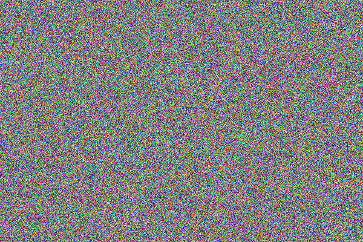

!!! todo 
    1. Problem set
        1. Add movement of the stars?
    2. Use render as a way to talk about best practices
        1. pkg management

# A Simple Renderer

In the introductory chapter, we briefly discussed the differences between graphical and computational programming interfaces for GPUs.
At the time, I openly stated, "If you are interested in building a game or rendering engine, it might be best to think of this book as a way to satiate some idle curiosity that might be lingering in the back of your head."

That statement is still true.
After all, computational fluid dynamics is quite different than the physics of water in video games.
The former typically involves rigorously solving a set of complex partial differential equations on an appropriately-sized mesh for a specific engineering problem.
The latter could be anything, as long as it fits the artistic style necessary for the medium and doesn't hurt the application's overall performance.
Both of these groups are trying to solve different problems.
Even more simply: one wants to be as accurate as possible, while the other wants to use the least resources while still providing a decent final result.

It is also true that graphical interfaces have been around for a lot longer than computational ones.
OpenGL (The Open Graphics Language), for instance, was initially released on June 30, 1992.
CUDA was released on February 16, 2007.
At this stage, both graphical and computational interfaces are relatively mature, but it could be said that some of the graphical interfaces are starting to show their age.

Though this book primarily focuses on GPU computing, it is still important to talk about graphical workflows because:
1. Historically, graphical applications have been the primary driver of GPU technology, though this has changed recently with many people using GPUs for cryptocurrency mining and machine learning.
2. With a better understanding of traditional graphics interfaces, it becomes easier to integrate computational workflows into a broader class of applications.
3. It is possible to do computation with graphically-oriented interfaces.
4. It is possible to do graphics with computationally-oriented interfaces.

This chapter will tackle point 4 above.
After all, we have only learned how to do broadcasting and write out a simple kernels.
Now it's a good idea to take a second and do something both visual and interesting with that knowledge.
In particular, this chapter will be our first adventure into a field known as "software rendering," which is the act of using non-traditional graphics workflows (in this case, GPU computation) to render an image, video, or other application.

So let's start by talking about graphics: how it works with traditional interfaces and how we can emulate the same behaviour with compute kernels.

## The graphics pipeline

Like in the computing landscape, there are also a bunch of different graphical interfaces that are used by different groups for different purposes:

* **DirectX** is a Microsoft-proprietary interface and has been the standard for game development for ages, and is part of the reason why Windows is so dominant in the gaming space.
* **OpenGL** is the "Open Graphics Language" and is the sister langauge to OpenCL, the Open Compute Language. They share similar strengths and weaknesses. OpenGL is a little more annoying to use and therefore much less common than other tools.
* **Metal** is an Apple-based proprietary interface for Mac devices. We have mentioned it before because it is also the interface Julia is using under-the-hood for computation on Mac devices.
* **Vulkan** is a new interface developed by Khronos (the same group as OpenCL and OpenGL). It is much lower-level than OpenGL, but aims to dust off a load of technical debt that has accrued over decades of continuted development of OpenGL.

Though all these interfaces are different, they generally follow the same guiding principles from start to finish.
It is also important to note that these guiding principles are more restrictive than those used for computation.
That is to say that almost all graphical interfaces are split into two stages: the construction and movement of vertices within a mesh, and the coloring of that mesh.
In the case of graphical applications, the functions that are written to do this work are similar to compute kernels, but called "shaders" instead.
An example set of available shaders can be seen in the following image:

ADD FIGURE OF WORKFLOW + DESCRIPTION OF EACH STEP

But what if your graphical application does not need a mesh?
That's actually a really good question.
There are plenty of approaches that can do a lot with only fragment shaders.
Inigo Quilez, for example, has made a name for himself doing signed distance field visualizations, which is a cousin to raytracing and can be done without a mesh.
There are also a large number of point-cloud representations that have become popular in recent years for techniques known as "Gaussian Splatting" and LIDAR for autonomous vehicles.

I would like to take a second and highlight something I glossed over in this section.
Namely, graphical interfaces have had decades of continual development, all to do one thing: manipulate and color meshes.
But why meshes?
The simple answer is that meshes are convenient abstractions for three-dimensional graphical applications.
As long as the mesh has a significant number of vertices to manipulate, it makes sense to create a vertex shader to make use of parallel hardware and move all the vertices in one, simple function.
As long as there are a large number of pixels on your screen, it makes sense to create a fragment shader to color each pixel independently of the others.
Both of these processes can largely be done independently and in parallel without cross-talk between threads on a GPU.
For these reasons, the graphics community has been generally happy to standardize on meshes for the majority of their work.

There have always been some relatively fringe cases where it has made sense to use non-mesh based graphical workflows.
For example, particle systems for fire, fluid sims, or photogrammetry, which is the process of creating a three-dimensional scene from a series of two-dimensional images.
The problem in these cases is that it is often difficult for artists to interface with graphical code, which is another big reason meshes remain so dominant in the graphics space.
Simply put, graphics is the intersection between art and computation and meshes allow both groups to coexist peacefully.

## A Starry Night in Julia

First things first, what is a "render"?
To be honest, it could mean different things to different people, but it is generally the act of using the computer to generate pixels in an image.
For game developers, there is an additional restriction that the images are generated in close to real-time so that each frame in the game provides the illusion of motion.
For those making films, there is no such restriction.

For our purposes, we will be working mainly in the latter camp.
That is to say, we will not be creating an image that is immediately drawn to screen.
Instead, we will generate an image, save it to file, and then look at it in a separate wikndow.
In particular, we will draw the following simple image using a computational workflow in Julia:

ADD IMAGE

In addition to drawing this image, we will also introduce a core concept in Julia that allows programmers to create more reproducible code.

### Creating a Project in Julia

In the previous chapter on GPU abstractions, we loaded several packages, such as `Plots`, `KernelAbstractions`, and whatever GPU backend was necessary for you.
This means that all the code we wrote in that chapter was dependent on some code written by other people.
This is normal in software development.
Everything is built on everything else.

But let's say you, the reader, were super excited about GPU computing and you wanted to show off the code you wrote to your friend who had a completely different device.
To do so, you might need to manually instruct your friend to download and `add` each package in the same way you did before.
It's a little chore, but not a huge deal.

But what if you had written even more complex software with many, many more dependencies?
In this case, it would be a lot harder to explain to your friend all the different packages they would need to install.
It would be easier to instead provide a separate script to do the installation for them.

This is exactly what `Project`s are for in Julia.
They are environments that keep track of all of the software necessary to run a particular piece of code.
When a new user wants to run the code, they simply have to load the project and the Julia package manager takes care of the rest.

So let's get started in using and creating projects in Julia

First things first, we'll open the Julia REPL and `generate` the new project with some name.
Seeing as how we are doing rendering in this chapter, let's the call the package `Renderer`.
so:

```
(@v1.11) pkg> generate Renderer
  Generating  project Renderer:
    Renderer/Project.toml
    Renderer/src/Renderer.jl
```

After this, we can exit the REPL with `CTRL+D` or backspace (to exit the package mode) and then `exit()`.
If we `ls`, we will find a new directory called `Renderer`.
`cd` into that, and we'll find a few files:

```
[leios@noema Renderer]$ cat Project.toml 
name = "Renderer"
uuid = "8bd4e8de-a7fd-44f3-b4d0-1e5b8c3fc9f3"
authors = ["James Schloss <jrs.schloss@gmail.com>"]
version = "0.1.0"

[leios@noema Renderer]$ cat src/Renderer.jl 
module Renderer

greet() = print("Hello World!")

end # module Renderer
```

These first file, `Project.toml` keeps track of all of the packages necessary to run the code.
The second file, `src/Renderer.jl` is a skeleton where the main chunk of the code is expected to be written.

Now let's add some packages and tinker around a bit.
First, let's open Julia:

```
julia --project="."
```

Here, we added a `--project` flag, indicating that we want to open a Julia session that is attached to the Renderer project.
We also specified that our `Project.toml` file is in the current directory by appending `="."` to the flag.
To be clear, we do not have to add the `="."` all the time.
Simply using `--project` without specifying the directory is also fine if it is clear what project we are working with.

Now, let's install some packages we know we will need.
In particular, `Images` and `KernelAbstractions`:

```
(Renderer) pkg> add KernelAbstractions Images
```

As an important side note, the package mode now indicates that we are within the `Renderer` project with the `(Renderer)` prefix before `pkg>`.
Also, I omitted a bunch of lines indicating the specific packages that were installed.
Now, let's double-check our work and see what we have installed. This can be done by running the `status` (or `st`) command in package mode:

```
(Renderer) pkg> st
Project Renderer v0.1.0
Status `~/projects/books/gpu-handbook/scripts/Renderer/Project.toml`
  [916415d5] Images v0.26.2
  [63c18a36] KernelAbstractions v0.9.34
```

Now there are a couple tricks being played here.
Firstly, the `Project.toml` file has been updated to show the new packages.
But secondly, another file has been created called `Manifest.toml`

Remember, all code is built on other code.
Here, we have only specified two packages.
This is all the information Julia needs to make sure your code can be run anywhere; however, there are a bunch of other packages we did not specify.
The `Manifest.toml` file carries those packages.

For now, this is all we need to know about projects in Julia.
We can actually start writing our code.

### Creating an Image in Julia

Let's play around with one of the packages we just installed, `Images`.
Similar to the last chapter, we will be doing this entirely in the REPL, but you could also write the code in a separate file and `include("filename")` to run the code.
Whichever you prefer.

Simply put, `Images` is a package to read and write images in Julia.
More specifically, it will allow users to manipulate arrays of red, green, and blue pixels with the `RBG` (and `RGBA` for alpha values) color type(s).
These types are technically from the `Colors` package, which is a dependency of `Images`, but they are reexported by `Images` as well.
So, let's create an image!

```
julia> using Images

julia> a = rand(RGB, 400, 600);

julia> save("check.png", a)
```

Here we used `rand` on the `RGB` color type to create a 400x600 `Array`, and then saved it to file with the `save(...)` command.
The image should look something like this:




`Images` includes another package called `Colors`, which provides a red, greeen, blue color type called `RGB`.
It also provides `RGBA`, which includes and `alpha` value.

open file.png


## Now let's animate!

## Downsides of this approach

No access to pixel buffer
Pixar used this approach with render farms for a large number of their movies when they introduced raytracing in monster's inc.
