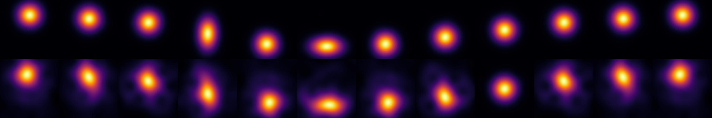
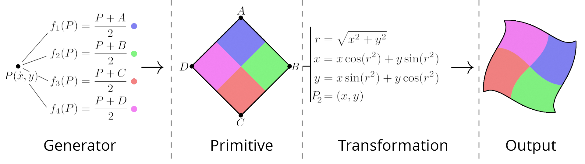

# Publications

### General purpose graphical rendering on quantum devices with composable function systems

#### Abstract
The controlled creation of specific quantum states is a highly challenging field of research that is also in high demand with applications in various quantum technologies.  Due to its difficulty, it has been historically impossible to use quantum states as a rendering target for complex scenes and visualizations, especially in the Noisy Intermediate-Scale Quantum (NISQ) era where operations are noisy and only a few qubits are available.  Even so, in this paper we propose a new, quantum compatible method for general purpose rendering by extending Composable Function Systems (CFSs) to quantum architectures.  We discuss limitations in the classical implementation of CFSs and the physical maps necessary for adapting the classical method to quantum by showing the generation of object primitives and transformations of such objects, including duplications and smears, some of which are topologically non-trivial.  Our results reveal the possibility of a speed-up for this, specific method on quantum hardware and our method has been used to create the first video rendered on quantum architectures.

#### Reference
[James Schloss and Ayaka Usui. General purpose graphical rendering on quantum devices with composable function systems](res/QCG_paper.pdf)

### Composable function systems as a general-purpose rendering framework

#### Abstract
Function systems exist as a natural language for the meshless creation and manipulation of complex objects while maintaining minimal memory on the Graphics Processing Unit (GPU) or Central Processing Unit (CPU).  This paper proposes a new method for general-purpose (non-fractal) visualizations and simulations with function systems and introduces Quibble, a metaprogramming framework for composing such systems on the GPU.  This is the first time users can compose(for example) Iterated Function Systems (IFSs) with simple algebraic manipulations to create complex scenes.  We also discuss several core advantages of this method including runtime performance, the creation of topologically non-trivial objects, and interoperability with other graphical algorithms.  Beyond general-purpose imagery and animations, this method can also be used to give artists more control over in-between frames in low-framerate animations, controllably deform point clouds, and metaprogram difficult animation workflows.

#### Reference
[James Schloss. Composable function systems as a general-purpose rendering framework. *arXiv preprint*, arXiv:2606.02226, 2026.](res/CFS_paper.pdf)
