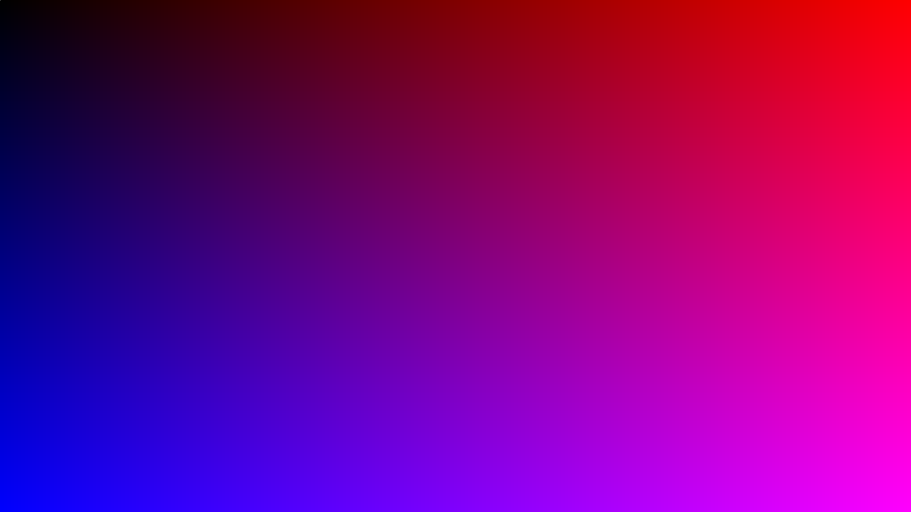

# A Simple Shader

In computer graphics, the term "shader" could mean a lot of things to a lot of people.
For example, in OpenGL and Vulkan, a "shader" basically means "A function that can be run on the GPU."
The most common shaders are:

* Vertex Shaders: Functions that move the vertex points of different meshes around
* Fragment Shaders: Functions that color pixels on the screen

For this example, we will be emulating the latter behaviour.
The full source code can be found [here](https://github.com/leios/quibble/blob/main/examples/simple_shader.c).
Please refer to this file if you are ever stuck!

To start, make sure that you have quibble properly installed, as shown in the [workflow section](workflow.md).
Once that is done, this example should be completely compilable with:

```
gcc -o simple_shader simple_shader.c -lquibble
```

But remember that if you did not `make install`, you will have to specify the path to the quibble library with `-L` and quibble include file with `-I`.

In general, every quibble program can be decomposed into a few key steps:

1. Write the program (preferably using the `__poem`, `__stanza`, and `__verse` identifiers as mentioned in the [workflow](workflow.md) section).
2. Build the program
3. Specify the output format
4. Create a camera
5. Set program arguments
6. Run the program
7. Output

It sounds like a lot, but if I remove all the comments from [the example script](https://github.com/leios/quibble/blob/main/examples/simple_shader.c), it's only about 25 lines of code.
Also, keep in mind, that half of that is spent on step 1.
In fact, subsequent examples might omit steps 2-7 entirely unless there are important changes to keep in mind.

So, let's get to it!

## Step 1: Our first quibble scribble

There are multiple different ways to write quibble scribbles.
The preferred method is to read them in from another file; however, I have also provided a macro (`QBINLINE`) to allow for users to inline the program definitions in their C files.
We'll be using `QBINLNIE` for this example and in subsequent examples when it's convenient.

Now, what do we want this, specific, scribble to do?
Well we probably want to color each pixel in some way.
Cool.
How do we do that?

We could spend an unlimited amount of time fussing about the exact details here, but I'm just going to create a linear gradient along $$x$$ and $$y$$, where as we move to the right, the output image becomes more red and as we move down, the output image becomes blue.
Something like this:



There are a bunch of different ways to do this.
The easiest is to just color our output image based on whatever array index we are working with.
This example will take it one step further and define the concept of a `point` in real space that will then be transformed back into pixel space.
The goal is to create a series of points such that there is exactly one point for each pixel.
These will then be histogrammed to screen in order to write their color information.


So let's start!

### 1.1: The data structures

For this example, we'll need pixels with color information and we'll need some method to convert real space coordinates into pixel coordinates.
We can dig into these in more detail later, but for now, let's just think about the types:

1. `quibble_color_rgba888` / `quibble_color_rgba8888`: These are colors used by quibble and can be either RGB (red, green, blue) or RGBA (red, green, blue, alpha). The `888` and `8888` correspond to the size of each channel of `R`, `G`, `B`, or `A`. Right now, these are the only supported color types.
2. `quibble_point_nD`, where `n` is the dimension. These are just $$x$$, $$y$$, $$z$$ floats to hold real space values.
1. `quibble_pixels_rgb888` / `quibble_pixels_rgba8888`: These are seemingly simple types that hold pixel data as either `RGB888` or `RGBA8888`s. There's a bit more going on under-the-hood, but you (the user) shouldn't have to worry too much about it.
2. `quibble_simple_camera`: This is a simple struct to hold all the information necessary to transform real space coordinates into pixel space.

I think that's all we need to know for now.

### 1.2. The functions

Keep in mind that each quibble scribble is executed as a GPU kernel.
This means that we each scribble will always have access to the internal index of each thread with the `_idx` variable.
So, it would seem we need the following functions:

1. `qb_find_point_location(_idx, cam)`: This will give us a floating-point representation of where each pixel is located.
2. `qb_color_rgba8888(0,0,0,1)`: This will create a non-transparent black color to work with. If you want a different starting color, you can modify the `(0,0,0,1)` to be whatever you like. They stand for red, green, blue, and alpha and range from 0 to 1.
3. `qb_color_clamp(value, 0, 1)`: This will convert a floating point value (ideally between 0 and 1) into something that will fit into `RGB888` or `RGBA8888`.
4. `histogram_output_rgba8888(pt, color, cam, pixels)`: This will histogram everything to screen and convert our floating point positions back into an integer index before coloring the specified pixel.

### 1.3. On `@include`

Now, where are these data structures and functions defined?
Well, in other scribbles.
Quibble scribbles are scripts and can include other scripts, and for this example, we will use:

```
@include "QB/simple_shader.qbl"
```

Where `QB` is the install location of all the quibble scripts (`XDG_CONFIG_HOME` or `/home/username/.config/quibble`).
When you ran `cmake` earlier, the `configure` command was also run to move all the files to the right place.
Otherwise, you can use local directories.
If you choose to do this, it's important to note what path you are building your program in so the files can be found!

### 1.4. All together

Right. I think that's everything.
The final block of code will look something like this:

```
#include "quibble.h"

int main(void){
   ...
    char *program = QBINLINE(
        @include "QB/simple_shader.qbl"
        __poem simple_shader(quibble_pixels_rgba8888 qps,
                             quibble_simple_camera qcam){
            quibble_point_2D pt = qb_find_point_location(_idx, qcam);
            quibble_color_rgba8888 qcolor = qb_color_rgba8888(0,0,0,1);

            qcolor.red = qb_color_clamp(
                (pt.x - qcam.world_position_x) / qcam.world_size_x,
                0, 1
            );

            qcolor.blue = qb_color_clamp(
                (pt.y - qcam.world_position_y) / qcam.world_size_y,
                0, 1
            );

            histogram_output_rgba8888(pt, qcolor, qcam, qps);
        }
    );
    ...
}
```

As a reminder, the `__poem` keyword essentially prescribes the final kernel to be run.
In other words, it's the top-level of a quibble scribble.

## Step 2: Building the program

Luckily, all subsequent steps are much easier.
Building, for example, only involves two commands.
Here's the first:
```
quibble_program qp = qb_parse_program(program, "");
```

Here, we are reading in the program string as `program` and setting the path to expand all scribbles on.
For this example, it's set to be `""` because our scribbles are being pulled from the global `QB/` directory.

The second command is a little trickier and requires us to have some knowledge of our system.
In particular, we need to know *which device we want to run our code on*.
To get this information, we need to run the associated `qbinfo` command.
For me, it outputs the following:

```
Platform 0: Intel(R) OpenCL. 1 known device(s)...
	Device 0: AMD Ryzen 7 7700X 8-Core Processor             
Platform 1: AMD Accelerated Parallel Processing. 2 known device(s)...
	Device 0: gfx1031
	Device 1: gfx1036
```

In quibble, we need to specify both the `platform` and `device`.
For me, if I want CPU execution, I'll run with `platform = 0` and `device = 0`. For GPU execution, I would run with `platform = 1` and `device = 0`.

So after parsing our program, we need to configure it with this information, like so:

```
    qb_configure_program(&qp, device, platform);
```

But that's it.
Once we've run these commands, we have built our program and are ready to move on to the next step!

## Step 3: Defining the output format

Quibble provides a data structure known as `quibble_pixels`, which essentially boils down to a pair of arrays of pixels (stored as, for example, a `quibble_color_rgba8888`).
I say a "pair of arrays" because there are technically two sets of pixels, one for the "host" (CPU) and another for the "device" (GPU, for example).
Traditionally, the allocation of data on the device is a bit of a chore, but we are hiding away a lot of that complexity with this struct.
For now, all we need to do is define the output resolution and specify our color type:

```
    int width = 1920;
    int height = 1080;
    quibble_pixels qpix = 
        qb_create_pixel_array(qp, width, height, RGBA8888);

```

### Step 4: Creating a camera

In quibble, a "camera" is essentially a method to transform points in real space to the integer indices necessary to manipulate the `quibble_pixels`.
In principle, this transformation can be from $$n$$-dimensional space to pixel space, but for this exercise, we will be using the `quibble_simple_camera`, which is exclusively in 2D.
To do this, we define 3 different variables:

1. `world_size_x` / `world_size_y`: These are real space units to map the pixels on to. For example, one might say that they want their 1920 x 1080 image to span 4 x 2.25 real space units.
2. `world_position_x` / `world_position_y`: These are the locations of the origin of the "world."
3. `ppu`: These are the "points per unit", or "pixels per unit". These are roughly equivalent to DPI (Dots Per Inch) for printing and correspond to the number of points in each real space distance of 1. For example, if the `world_size` is 4 and we want that to span 1920 pixels, we might say that our `ppu = 1920 / world_size = 1920 / 4 = 480`.

Altogether, it might look like:

```
    float world_size_x = 4;
    float ppu = width / world_size_x;
    float world_size_y = height/ppu;

    float world_position_x = 0;
    float world_position_y = 0;

    quibble_simple_camera qcam = qb_create_simple_camera(ppu,
                                                         world_size_x,
                                                         world_size_y,
                                                         world_position_x,
                                                         world_position_y);
```

### Step 5: Setting arguments

Ok. I'll admit that this is a weird one.
After all, if you define a function $$f(x)$$, then you don't *usually* need to set $$x$$ before invoking the function.
In principle, there might be a future incarnation of quibble that allows us to simply launch each quibble scribble as a normal function.
In practice (today), I am following the OpenCL convention of setting the arguments manually before launching the kernel.
Personally, I prefer it this way, as it allows me to set all my arguments up front and then only change specific arguments as they are needed during my main animation or game loop; however, I 100% acknowledge that this is not a typical design approach outside of GPU computing / graphics.

No matter the case, I've tried to make the process of setting function arguments to be as painless as possible and have provided a few different methods to do so.
For this example, we will be using a C-style variadic function that takes $$2n + 3$$ arguments, where $$n$$ is the number of arguments we wish to set.
For example, let's look at the code we need for this case:

```
    qb_set_args(&qp, "simple_shader", 2,
                "quibble_pixels_rgba8888 qps", qpix,
                "quibble_simple_camera qcam", &qcam);

```

The arguments are:
1. The program
2. The poem we are configuring.
3. The number of arguments we wish to set

Then a repeating pair of:
1. The argument (and type information) specified in the poem.
2. The data for that argument.

Note that something weird is happening here.
For `quibble_pixels_rgba8888 qps`, we are reading in `qps`, but for `quibble_simple_camera qcam`, we are reading in `&qcam`.
In the first case, we are using the variable directly.
In the latter case, we are using the pointer to a variable.
What gives?

This is because `quibble_pixels_...` are actually meta-variables and will unroll into a set of variables when we configure(d) our program.
That is to say we get a few variables with `quibble_pixels_...`:

1. `__global quibble_color_... var_name`: This is the actual data we are working with.
2. `int var_name_width` / `int var_name_heignt`: These are the `width` and `height` specified by the user.
3. `int var_name_color_type`: This is either `RGBA888` or `RGBA8888` depending on the situation and can be used to ensure we are outputting data in the correct format.

!!! note "Jank alert"
    I've since realized that we can hold almost all of this information in our `camera` and might remove this in the future. This actually won't change anything on the front-end for most users. It's just an internal detail.

### Step 6: Running the program

If steps 1-5 were done correctly, this *should* be as easy as:

```
    qb_run(qp, "simple_shader", width*height, 256);
```

But there are some "magic numbers" here.
The arguments for this function are:

1. The program
2. The poem to run (that is fully configured at this stage)
3. The number of threads to run in parallel (here set to `width*height`, as that is the number of pixels we want
4. The `workgroupsize`, which is the number of threads we want in each block

Right now, 4 is set to be 256, which is a nice heuristic for GPU computation, but can be set somewhat arbitrarily.

!!! note "Jank alert"
    I might be removing the `workgroupsize` in future incarnations of quibble. Not sure. I like having it available.

### Step 7: Returning the data and saving

At this stage, the code *should* have executed on the "device" (GPU).
Now, we just need to send that data back and save it:

```
    qb_pixels_device_to_host(qpix);
    qb_write_png_file("check.png", qpix);
```

And then free everything:

```
    qb_free_program(qp);
    qb_free_pixels(qpix);
```

And that's it.
You should have the image we are looking for saved as `check.png`.
Note that there are also output functions for `jpg` and `bmp`, if you wish to use these functions instead.
`jpg` will take a compression ratio as a 3rd argument that ranges from 0-100.

!!! note "Jank alert"
    I have contemplated running `qb_pixels_device_to_host(qpix)` on every `qb_run(...)`, but have decided against it because data transfer between the host and device is always (always) the slowest part of any GPU computation and should be avoided at all costs. There are plenty of situations where users might want to keep the data on the GPU for various tasks and send the information back after a few different `qb_run(...)`s. They might even send the data to Vulkan or something and forego transferring it back to the host entirely.
    
    Long story short, I know this looks a bit clunky, but I feel it's necessary to be explicit.

## Conclusions

So that's where we are at right now.
We can create basic images without much work (25 lines).
As I mentioned throughout this example, there is still a lot of room for improvement as I iron out the kinks here and there, but I am ultimately happy with how things are going.
If you have specific issues you would like to discuss, please do so on [github](https://github.com/leios/quibble/issues).
Also, again, [here is the full code](https://github.com/leios/quibble/blob/main/examples/simple_shader.c).

!!! note "A simple exercise"
    Do this again, but without using the `point` data structure. Just color each pixel based on the index of the array

