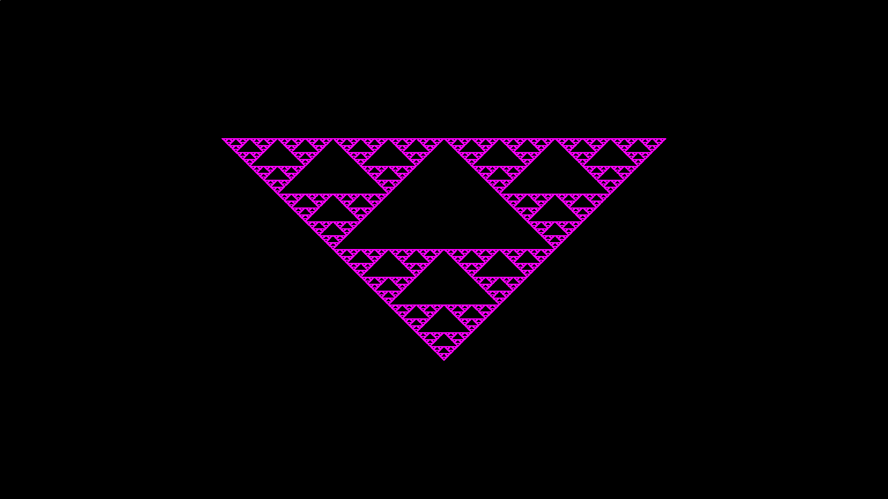

# Your First Fractal

Alright. I'mma come out and say it.
Everyone and their mother knows about the Sierpinski triangle.
It's a triangle of triangles of triangles shown below:



In this example, we are creating the above image by following the same workflow [as before](example_1.md).
It is strongly recommended to read the first example before continuing.
I would also recommend you read the [Algorithm Archive chapter on Iterated Function Systems (IFS)s](https://www.algorithm-archive.org/contents/IFS/IFS.html), as it covers key information you might want (but don't need) to know about how the Sierpinski triangle is made.
Finally, the full code can be [found here](https://github.com/leios/quibble/blob/main/examples/chaos.c).
Please refer to that code if you have any questions!

For our purposes, this example will introduce two core concepts:
1. Colors *with priority* to specify how colors interact with each other.
2. Generating functions which are usually functions tagged with the `__stanza` keyword and called with the `@SCALL` command in quibble scribbles.

Let's start by examining the image above and picking it apart.
If we wanted to be pedantic, we could say that the scribble we will be writing today should be doing 4 different actions:
1. Creating a black background color
2. Outputting that color to screen
3. Creating a pink Sierpinski color
4. Outputting that to screen

Steps 1 and 2 were (more or less) done in [the last example](example_1.md) and shouldn't pose too much of a problem:

```
...
    quibble_point_2D pt = qb_find_point_location(_idx, qcam);
    quibble_color_rgba8888 qcolor = qb_color_rgba8888(0,0,0,1);
    histogram_output_rgba8888(pt, qcolor, qcam, qps);
...

```

But there *is* a little snag here.
Namely that these scribbles are being distributed to a bunch of cores.
Some of these cores could finish their job quickly.
Others might take some time.
For this reason, we need some feature to distinguish what happens if (let's say) thread 1000 wants to write to the image, but there is already data there.

To solve this, I have introduced:

## Colors with Priority

Simply put, in addition to RGB(A) channels, there is an additional channel (P) for *priority*, which can be thought of as "the distance away from the camera."
Objects with a higher priority are closer.
Objects with a lower priority are further away.
Threads with color information can only write to screen if their color has a higher priority than the one already in memory.
Note that the thread will also refuse to write to screen if it has a color with the *same* priority.

These are created similarly to other colors:

```
quibble_pcolor_rgb888 = qb_pcolor_rgb888(0,0,0,0.5);
quibble_pcolor_rgba8888 = qb_pcolor_rgba8888(0,0,0,0,0.5);
```

Where `pcolor` stands for "priority color" and the `0.5` at the end signifies the priority.
Keep in mind that the priority (and all colors) are converted to an `unsigned char` value and (therefore) range from 0-255 in memory.
Even so, we specify each of the channels as floats for user convenience.

So let's go ahead and set up everything *but* the scribble with this information in mind:

```
#include <stdio.h>

#include "quibble.h"

int main(void){

    char *program = QBINLINE();

    quibble_program qp = qb_parse_program(program, "");
    qb_print_program(qp);
    qb_configure_program(&qp, 0, 0);

    int width = 1920;
    int height = 1080;
    quibble_pixels qpix = 
        qb_create_pixel_array(qp, width, height, PRGBA8888);

    float world_size_x = 4;
    float ppu = width / world_size_x;
    float world_size_y = height/ppu;

    float world_position_x = 0;
    float world_position_y = 0;

    quibble_simple_camera qcam = qb_create_simple_camera(ppu,
                                                         world_size_x,
                                                         world_size_y,
                                                         world_position_x,
                                                         world_position_y);
    qb_set_args(&qp, "chaos_shader", 2,
                "quibble_pixels_prgba8888 qps", qpix,
                "quibble_simple_camera qcam", &qcam);

    qb_run(qp, "chaos_shader", width*height, 256);

    qb_pixels_device_to_host(qpix);
    qb_write_png_file("check.png", qpix);

    qb_free_program(qp);
    qb_free_pixels(qpix);

    return 0;
}

```

This is basically identical to [the previous example](example_1.md) except that we have a few `p`s thrown in to the color definitions.
We will be calling our `__poem` `sierpinski_shader` for this example.

Now, let's add in the scribble for drawing the Sierpinski triangle.

## Generating functions and `__stanza`s

In a sense, Quibble has an overarching goal to minimize the amount of GPU memory stored for graphical applications.
In this example, we are generating hundreds of millions of points for our final triangle, but only storing enough data for the final output image.
How do we do this?
Well, we are going to split up the process of generating each point so that *as we are generating the triangle, we are also performing other operations to that point and outputting it to screen.*

In practice, this means that all Quibble primitives (the Sierpinski triangle included) will have specific locations for users to implement their own transformation functions.
That is, in essence, what a `__stanza` is.
A function that has a break point for user code that is written later.

For now, we don't need to drill too deeply into the details.
Instead, let's cover the basics.
Namely, the `sierpinski_chaos` `stanza` has a few function arguments:

1. `int num_iterations`: This is the number of times each point will move around and draw to screen.
2. `quibble_simple_camera cam`: This is the camera, as described in [the first example](example_1.md)
3. Repeating pairs of `quibble_point_2D` and `quibble_pcolor_rgba8888` for `a`, `b`, and `c`, the three vertices of the triangle. The colors associated with each vertex will be used for the triangle closest to each vertex.

Inside the stanza, there are also a few variables defined for users to call on in their user-code:

1. `quibble_point_2d _pt`: the point's location
2. `quibble_pcolor_rgba8888 _clr`: the color associated with the latest function call.
3. `int _i`: the iteration we are on for that, specific point.

Ok, that should be enough information for the scribble:

```
@include "QB/chaos.qbl"
@include "QB/output.qbl"
__poem chaos_shader(quibble_pixels_prgba8888 qps,
                    quibble_simple_camera qcam){

    // Setting the screen to black
    quibble_point_2D pt = qb_find_point_location(_idx, qcam);
    quibble_pcolor_rgba8888 qcolor = qb_pcolor_rgba8888(0,0,0,1,0.1);
    histogram_output_prgba8888(pt, qcolor, qcam, qps);

    // Creating a color for the triangle and setting vertex points
    qcolor = qb_pcolor_rgba8888(1,0,1,1,1);
    quibble_point_2D pt_1 = qb_point_2D(0, 0.5);
    quibble_point_2D pt_2 = qb_point_2D(-1, -0.5);
    quibble_point_2D pt_3 = qb_point_2D(1, -0.5);

    @SCALL sierpinski_chaos(100, qcam,
                            pt_1, qcolor,
                            pt_2, qcolor,
                            pt_3, qcolor){
        // Outputting to screen iff we are above iteration number 10
        // 10 is arbitrarily chosen and just makes sure we are actually
        // on the triangle
        if (_i > 10){
            histogram_output_prgba8888(_pt, _clr, cam, qps);
        }

    }
}

```

And that's that.

A few quick notes:
1. We are using `histogram_output_prgba8888` with a `p` in it for priority color.
2. We are injecting our own output command within the set of curly brackets after the `@SCALL`. If we did not output here, we would not see the triangle.

## Conclusions

This example showcases how `__stanza`s are typically used in quibble scribbles.
Namely as generating functions for object primitives.

!!! note "A simple exercise"
    Do this again, but color each sub-triangle differently. Maybe one is read, another blue, and another green. Or whatever colors float your boat.
    
    I'm not your boss.
