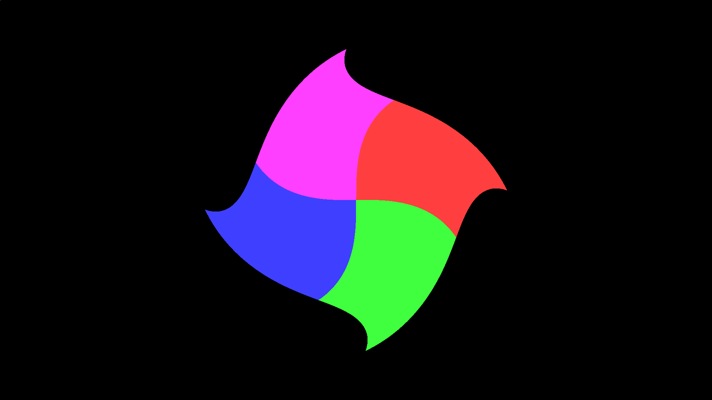

# A Swirled Square

Following [example 1](example_1.md) and [example 2](example_2.md), we have established that:

1. `__poem`s ultimately transform into OpenCL kernels.
2. `__stanza`s allow users to generate shapes to be manipulated inside of `__poem` calls.

But we have not really done anything with the previously generated shapes (except draw them to screen). 
In this example, I will show our first (non-trivial) transformation of an object primitive to create the following image:



The C code can be found [here](https://github.com/leios/quibble/blob/main/examples/swirled.c) and the quibble scribble [here](https://github.com/leios/quibble/blob/main/examples/swirled.qbl).
As the C code is largely shared between the three examples, I will not re-explain it here.
Instead, I'll just point out that instead of using `QBINLINE`, we will be reading the quibble scribble in from file like so:

```
quibble_program qp = qb_parse_program_file("swirled.qbl");
```

Everything else is more or less the same.
Even the `__poem` is similar to the Sierpinski example before.
The notable differences are:

1. We are coloring the square 4 different colors
2. We will be using another Quibble keyword `__verse` for the innermost function being called by our `__stanza`.

As 1 is a quick fix, let's focus on 2.

## What are `__verse`s?

Simply put, `__verses` are like functions, but you get quibble advantages, such as:
1. Keyword arguments
2. No scoping (so you can call variables defined in the `__stanza` or `__poem` level).

For this example, we want to create a verse that does the following:

1. Colors the square somehow
2. "Swirls the square" by rotating them more strongly as we move further from the origin of the image

We can play around with this, but here's an idea of what we are looking for:

```
__verse swirl(quibble_point_2D pt,
              quibble_pcolor_rgba8888 clr_1,
              quibble_pcolor_rgba8888 clr_2,
              quibble_pcolor_rgba8888 clr_3,
              quibble_pcolor_rgba8888 clr_4 |
              int num_ignore = 20;){

        if (pt.x > 0 && pt.y > 0){
            _clr = clr_1;
        }
        else if (pt.x > 0 && pt.y <= 0){
            _clr = clr_2;
        }
        else if (pt.x <= 0 && pt.y <= 0){
            _clr = clr_3;
        }
        else if (pt.x <= 0 && pt.y > 0){
            _clr = clr_4;
        }

        float r = sqrt(pt.y*pt.y + pt.x*pt.x);

        pt.x = _pt.x*cos(r*r) + _pt.y*sin(r*r);
        pt.y = _pt.x*sin(r*r) - _pt.y*cos(r*r);

        if (_i > num_ignore){
            histogram_output_prgba8888(pt, _clr, cam, qps);
        }
}
```
Note here that the `_pt` variable was defined by the `rectangle_chaos` `__stanza`.
After this, we just need to throw it back into the `__stanza` and `__poem`:

```
__poem square_shader(quibble_pixels_prgba8888 qps,
                     quibble_simple_camera qcam){

    // Drawing a black background first
    quibble_point_2D pt = qb_find_point_location(_idx, qcam);
    quibble_pcolor_rgba8888 qcolor = qb_pcolor_rgba8888(0,0,0,1,0.1);
    histogram_output_prgba8888(pt, qcolor, qcam, qps);

    // These colors have a different priority so that different threads
    // don't overlap each other at the boundaries.
    quibble_pcolor_rgba8888 v1_color = qb_pcolor_rgba8888(1,0.25,0.25,1,0.5);
    quibble_pcolor_rgba8888 v2_color = qb_pcolor_rgba8888(0.25,1,0.25,1,0.6);
    quibble_pcolor_rgba8888 v3_color = qb_pcolor_rgba8888(0.25,0.25,1,1,0.7);
    quibble_pcolor_rgba8888 v4_color = qb_pcolor_rgba8888(1,0.25,1,1,0.8);

    // Setting default color for square
    // This will be ignored because we are creating a custom verse
    qcolor = qb_pcolor_rgba8888(1,0,1,1,1);

    @SCALL rectangle_chaos(100, qcam, qcolor |
                           scale_x = 0.6; scale_y = 0.6;){
        @VCALL swirl(_pt, v1_color, v2_color, v3_color, v4_color);
    }
}
```

And that's that.
A swirled square.
The only thing to note is that I gave each of the colors in the square a different priority.
This ensures that the color boundaries remain smooth.
After all, at the boundary between two colors (let's say red and green), it could be possible for threads of either color to write to those locations.
By giving each color a priority, I specify which thread should write to where and when.

This example showcases how easy it is to create complex transformations on quibble primitives.
