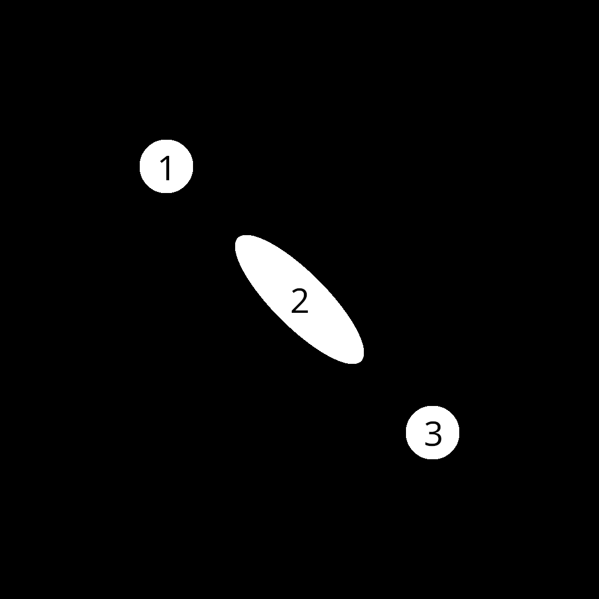

# Smear Frames

In many (most) animations, artists will create different kinds of frames with different purposes.
*Key frames* are those with very specific details that the audience must pay attention to in order to understand the purpose of the work.
Then there *in-betweens* -- frames that are drawn in-between key frames with the intent of guiding the audience's attention to the next item of interest.
When there is heavy motion between different key frames, artists will draw *smear frames*, where the physics is distorted and characters will look plain wacky.

There is a strong debate within many different artistic communities about when and where key frames should be used, and I am not about to start that debate.
Rather, I want to show a simple example of smear frame generation in quibble:



Here, I have superimposed the frame number on to each blob.
Blob 2 is the smear frame we are generating here.

This example will closely follow the previous ones ([1](example_1.md), [2](example_2.md), and [3](example_3.md)), so be sure to browse through those if you haven't already.
Also, the full code can be found on github ([C](https://github.com/leios/quibble/blob/main/examples/smear.c), [quibble](https://github.com/leios/quibble/blob/main/examples/smear.qbl)).

## Generating multiple frames in C

The biggest difference between this example and [the previous one](example_3.md) is that we will be modifying the C code here to generate multiple frames.
In particular, we will be adding additional arguments to our `poem` that will be modified each frame and then modifying those variables on the C side each frame from within a loop.

As we are generating a smear frame, the two most important variables to pass in to the quibble scribble will be `position` and `velocity`, with `velocity` changing the shape of our object.
Let's look at the loop first:

```
    for (int i = 0; i < num_frames + 1; ++i){

        location = qb_point_2D(-0.5 + (float)i/num_frames,
                               -0.5 + (float)i/num_frames);

        if (i < half_frame){
            velocity = qb_point_2D(2 * (float) i / half_frame,
                                   2 * (float) i / half_frame);
        }
        else{
            velocity = qb_point_2D(2.0 - 2.0 * (i-half_frame) / (half_frame),
                                   2.0 - 2.0 * (i-half_frame) / (half_frame));
        }

        qb_set_args(&qp, "smear_shader", 2,
                    "quibble_point_2D location", &location,
                    "quibble_point_2D velocity", &velocity);

        qb_run(qp, "smear_shader", width*height, 256);

        qb_pixels_device_to_host(qpix);

        create_filename(filename, i);
        qb_write_png_file(filename, qpix);
        printf("%s\n", filename);
    }

```

Here, we are iterating through `num_frames` and moving the ball from $$(-0.5, -0.5)$$ to $$(0.5, 0.5)$$.
We are also modifying the velocity such that it increases until we hit `float half_frame = num_frames*0.5`, and then decreasing past that point.
Every step, we are using `qb_set_args(...)` to set the arguments `location` and `velocity` each frame.
Then we `qb_run`, get send the pixels to the host (CPU -- `qb_pixels_device_to_host(qpix)`), and then write to file.
Note that the filename generation will create a bunch of files that look like `checkxxxx.png`, where the `xxxx` will be replaced with the frame number.
This is done with the following function:

```
void create_filename(char *buffer, int i){
    sprintf(buffer, "check%d%d%d%d.png",
            i%10000 - i%1000,
            i%1000 - i%100,
            i%100 - i%10,
            i%10);
}
```

Everything else follows from previous examples.
The full code can be found [here](https://github.com/leios/quibble/blob/main/examples/smear.c).

## The quibble scribble

The quibble scribble also largely follows from the [previous example](example_3.md).
In this case, we need to create a smear function and then a main poem:

```
@include "QB/chaos.qbl"
@include "QB/output.qbl"

quibble_point_2D rotate(quibble_point_2D pt, float theta){
    return qb_point_2D(pt.x*cos(theta) - pt.y*sin(theta),
                       pt.x*sin(theta) + pt.y*cos(theta));
}

__verse smear(quibble_point_2D pt,
              quibble_point_2D location,
              quibble_point_2D velocity | 
              int num_ignore = 20;){

    float theta = atan2(velocity.y,velocity.x);
    if (pt.y < 0){
        theta += 2*M_PI;
    }

    // Moving back to origin for a simpler transform
    pt.x -= location.x;
    pt.y -= location.y;

    // Scaling along x by the speed (magnitude of velocity)
    pt.x *= 1 + sqrt(velocity.x*velocity.x + velocity.y*velocity.y);

    // Rotating according to velocity direction
    pt = rotate(pt, theta);

    // Moving back to correct location
    pt.x += location.x;
    pt.y += location.y;

    if (_i > num_ignore){
        histogram_output_prgba8888(pt, _clr, cam, qps);
    }
}

__poem smear_shader(quibble_pixels_prgba8888 qps,
                    quibble_simple_camera qcam,
                    quibble_point_2D location,
                    quibble_point_2D velocity){

    // Drawing a black background first
    quibble_point_2D pt = qb_find_point_location(_idx, qcam);
    quibble_pcolor_rgba8888 qcolor = qb_pcolor_rgba8888(0,0,0,1,0.1);
    histogram_overwrite_prgba8888(pt, qcolor, qcam, qps);

    qcolor = qb_pcolor_rgba8888(1,1,1,1,1);

    @SCALL circle_chaos(100, qcam, qcolor |
                        location = location; radius = 0.1;){
        @VCALL smear(_pt, location, velocity);
    }
}
```

It is worth inspecting the code here, but it is not too much more interesting on a philosophical level.

### Wrapping it into a video

After compiling and running this code, we have a bunch of images to string together into a final video, which we can do with FFMPEG (for example):

```
ffmpeg -r 2 -i check%04d.png -c:v libx264 -pix_fmt yuv420p output.mp4
```

I do not wish to go into all the details here because FFMPEG is it's own package with it's own (often indecipherable) API.
For now, know that:

1. `-r` changes the frame rate
2. `-i` is "input." There is no `-o` for "output"
3. `%04d` in `check%04d.png` stands for "a number with 4 digits that is left-padded with 0s"
4. `c:v libx264 -pix_fmt yuv420p` specifies video codecs
5. `output.mp4` is the output file

FFMPEG is a powerful tool that is useful in a wide variety of places, but this is not an FFMPEG guide, so I'll politely refer you to google for more information on it.


